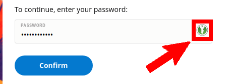

En god adgangskode er svær at huske. Overvej nu konsekvensen af nødvendigheden af forskellige adgangskoder for enhver onlinetjeneste… pludselig stiger mængden af adgangskoder, der er svære at huske, til noget fuldstændig uoverskueligt. Det er måske ikke noget problem for en verdenshukommelsesmester som Jonas von Essen, men langtfra let for os mere almindeligt dødelige.

Din umiddelbare reaktion vil måske være at notere alle adgangskoderne ned. Nu vil problemet i stedet være beskyttelsen af disse noter eller filer. En løsning er kryptering af filen indeholdende adgangskoderne. Dette er essensen af en password manager, men selvfølgelig tilbyder password managers yderligere funktionalitet som eksempelvis automatisk login, password generatorer og andet der gør dit liv nemmere.

Der findes mange forskellige password managers. Nogle kan integreres i din webbrowser, som eksempelvis i Firefox eller Chrome, mens andre er cloudtjenester, mens andre igen er selvstændige programmer. Det rette valg bestemmes som oftest af dine personlige behov og præferencer. Vi anbefaler Open Source mulighederne, da de er frit tilgængelige og giver mest brugerkontrol.

Vi advarer mod brug af cloud-baserede løsninger, ligegyldigt hvor velrenommerede. En populær password manager ændrede lige pludselig sidste år deres brugervilkår for deres gratis version, og er nu praktisktalt ransomware.  

## KeePassXC Opsætning

KeePassXC er en open source password manager, har været tilgængelig siden 2012 og bliver revideret af eksterne parter. Det er ikke umiddelbart den mest praktiske password manager, da der kræves opsætning som browser plugin og en separat mobil applikation, men er tilbyder gengæld en høj sikkerhed.

[Download KeepassXC from here.](https://keepassxc.org/) Du skal bruge 64 bit MSI filen for installation. Dobbeltklik og installer filen.

Ved første opstart skal der oprettes en database for adgangskoderne. Klik ”Create new database” på første side.

Fortsæt med de næste trin. Du bør nu overveje hvilken adgangskode du ønsker databasen skal have. Det er nødvendigt med en maget robust og sikker adgangskode, du også relativt nemt kan at huske. Tænk på denne adgangskode som den eneste du fra i dag skal huske. Vælg en stærk adgangskode og lær den udenad. Yderligere, kan du tilføje multifaktor validering via YubiKey eller en selvstændig fil, hvilket ikke bliver forklaret nærmere her. 

Denne fil vil indeholde dine adgangskoder. Hvis den bliver lageret i skyen, som for eksempel Google Drive eller Dropbox, har du adgang til dine adgangskoder direkte fra alle dine mobile enheder.

## Grundlæggende Brug

Næste gang du starter KeePassXC, vil du se et skærmbilledet nedenfor og din database vil allerede være selekteret. Indtast din adgangskode for at få adgang til password databasen.

På nuværende tidspunkt er databasen tom, hvis du opretter en ny konto på et websted, benytter du din database og klikker ”Add a new entry” 

Udfyld siden med de påkrævede informationer. Hvis du gemmer URL’en, kan KeePass browser plug-inen automatisk udfylde adgangskode felter for webstedet i fremtiden. Du har muligheden for enten at lade KeePass generere en stærk og sikker adgangskode automatisk, eller manuelt at indtaste din egen kode. Klik terningikonet ”Generate new password” for autogenerering.

Nedenfor kan du se, hvordan du kan ændre tegntabellen og længden af adgangskoden for automatisk dannelse af nye stærke koder.

Du kan fra begyndelsen benytte password manageren uden yderligere opsætning og integration. Du kan helt enkelt manuelt kopiere adgangskoder gemt for websteder til din browser. Men hvis du foretrækker en mere enkel løsning; så læs videre.

## Browser Integration

Du vil for mindeligt gerne udnytte password manageren til automatisk udfyldelse af alle adgangskoder, der ellers kan være svære at huske. Her komme integration in i billedet. Du har brug for installation af browser add-ons for kommunikation mellem din webbrowser og password manageren. Der findes add-ons for de fleste browsere, hvor flertallet anvender Chromes add-on format. Hent og installer den korrekte add-on for din browser.

[Firefox Add-on](https://addons.mozilla.org/en-US/firefox/addon/keepassxc-browser/)

[Chrome Add-on](https://chrome.google.com/webstore/detail/keepassxc-browser)

Efter succesfuld installation, vil der være en lille ikon i højre side af din adresselinje. Klik ikonet for opsætning af KeePass browser-integrationen. **Det er nødvendig at KeePassXC er aktiv i baggrunden og låst op.**

Klik “connect”, du skal nu navngive forbindelsen. Indtast dit valgte navn.

Når du næste gang klikker på det grønne ikon, skulle du gerne kunne se et skærmbillede lignende dette:

KeePass vil nu tilbyde indtastning af dine adgangskoder, når det er aktivt i baggrunden. Der vil være et grønt KeePass ikon i autentifikationsfelter, når det klikkes vil KeePass automatisk indtaste adgangskoden.

Husk KeePassXC skal være aktivt kørende i baggrunden samt være låst op, for automatisk udfyldelse af koder.

## Anden Integration

Yderligere, findes der enkelte KeePassXC apps for mobiltelefoner. Hvis din adgangskode databasefil er gemt på eksempelvis Google Drive eller Dropbox, har du nu via dine mobile enheder mulig adgang til dine adgangskoder.

## Er du blevet PWNED?

Det anbefales kraftigt at du tjekker om dine adgangskoder er offentliggjort i et datalæk. Dette er specielt risikabelt hvis du har brugt den adgangskode, der er lækket, til flere websteder og konti.

Besøg [haveibeenpwned.com/](https://haveibeenpwned.com/) og tjek om din e-mailadresse er associeret med offentliggjorte datalæk.

Er nogen af jer blevet pwned?

Hvor mange datalæk var din e-mail inkluderet i? 

\vfill
 This work is licensed under a [Creative Commons Attribution 4.0 International License](http://creativecommons.org/licenses/by/4.0/).
